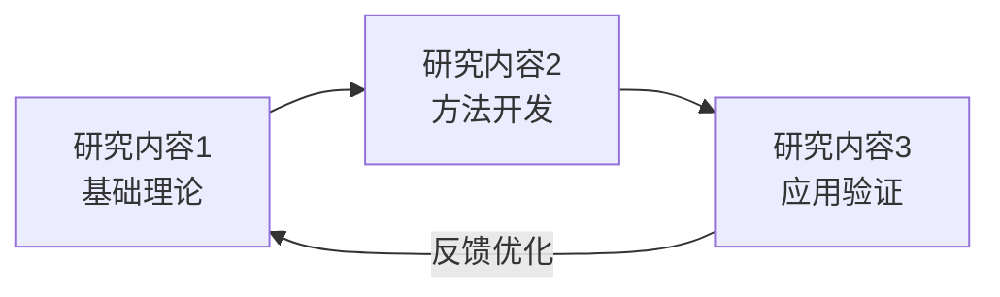
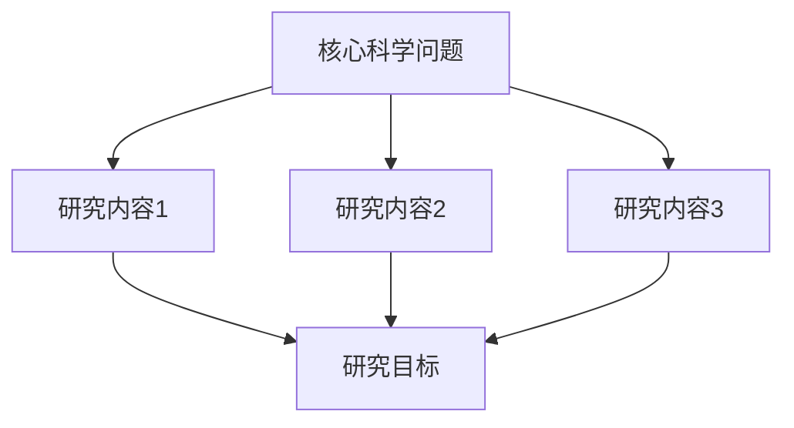
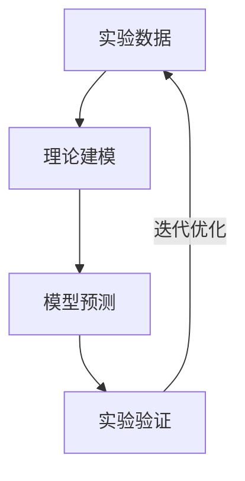
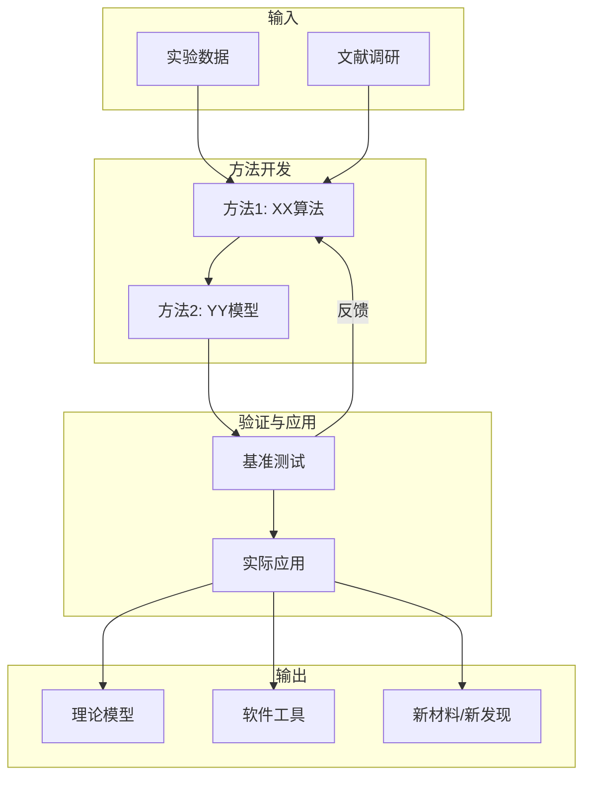
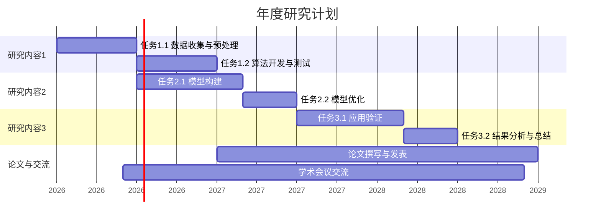

# NSFC 申请书图表制作指南

## 图表的重要性

- **第一张概念图**决定评审人的第一印象
- 图文并茂是评审人明确推荐的做法
- 不要从已发表论文PDF中截图（分辨率差，态度不诚恳）
- 图表要清晰、专业、自洽
- 同一申请书中保持风格和配色一致

---

## 申请书中常见的图表类型

### 1. 概念图/总览图（最重要）

**位置**：立项依据或研究内容开头
**作用**：一图概括整个项目的核心思路，展示"问题→方法→目标"的逻辑链

**设计要点**：
- 简洁，不超过5-7个核心元素
- 层次分明，从左到右或从上到下
- 色彩协调，突出重点
- 让大同行专家一眼看懂你要做什么

### 2. 研究内容关系图

**作用**：展示3-4项研究内容之间的逻辑关系

**常见布局**：

**层层递进型**：


**并行支撑型**：


**闭环迭代型**：


### 3. 技术路线图

**作用**：展示整个项目的实施路径
**要素**：输入 → 方法 → 中间产物 → 输出



### 4. 研究基础展示图

**作用**：汇总前期工作成果
**做法**：
- 将代表性论文的关键图表组合成一张综合图
- 每个子图标注论文出处
- 用简短文字说明与本项目的关联

### 5. 年度计划甘特图



---

## 制作工具

### Mermaid（推荐）
- 可直接在Markdown中使用
- 适合快速生成流程图、甘特图
- 导出为SVG/PNG
- 在线编辑器：https://mermaid.live

### Python (matplotlib)
- 适合生成高质量定制图表
- 脚本模板见 `scripts/generate_roadmap.py`
- 支持中文字体、高分辨率输出

**使用方法**：
```bash
uv run scripts/generate_roadmap.py \
  --title "技术路线图" \
  --nodes "数据采集,模型训练,性能评估,应用验证" \
  --output roadmap.png \
  --dpi 300
```

### TikZ（LaTeX用户）
```latex
\begin{tikzpicture}[node distance=2cm, auto]
  \node[draw, rounded corners] (A) {科学问题};
  \node[draw, rounded corners, right of=A] (B) {研究方法};
  \node[draw, rounded corners, right of=B] (C) {预期成果};
  \draw[->] (A) -- (B);
  \draw[->] (B) -- (C);
\end{tikzpicture}
```

### PowerPoint/Keynote
- 适合复杂概念图的手动制作
- 导出为高分辨率PNG（300 DPI以上）
- 使用"另存为图片"功能

---

## 设计原则

### 配色
- **蓝色系**：专业稳重，适合工程/物理/化学
- **绿色系**：适合生命科学/环境
- **暖色系**：适合能源/材料
- 同一申请书中保持配色一致
- 避免过于花哨的颜色
- 推荐工具：https://colorbrewer2.org

### 字体
- 中文：微软雅黑 / 思源黑体
- 英文：Arial / Helvetica
- 字号不小于8pt（打印后仍可辨认）

### 分辨率
- 最低**300 DPI**
- 矢量图优先（PDF/SVG）
- 避免JPEG压缩导致的模糊
- Word中插入图片后检查打印效果

### 布局
- 留白适当，不要塞满
- 对齐整齐
- 箭头方向一致（通常从左到右或从上到下）
- 图表编号连续（图1, 图2, ...）

---

## 常见错误

- ❌ 从PDF论文中截图（模糊、不专业）
- ❌ 图表过于复杂，信息过载
- ❌ 图表与正文描述不一致
- ❌ 图表编号混乱或缺失
- ❌ 图表中有错别字
- ❌ 不同图表配色风格不统一
- ❌ 图表分辨率太低（打印后模糊）
- ❌ 图表占用过多篇幅（挤占正文空间）

---

## 各类项目的图表数量建议

| 项目类型 | 建议图表数 | 重点图表 |
|---------|-----------|---------|
| 青年C（30万/3年） | 5-8张 | 概念图、技术路线图 |
| 面上（50万/4年） | 8-12张 | 概念图、研究内容图、技术路线图、研究基础图 |
| 重点（260万+/4年） | 10-15张 | 全套图表 |
| 重大研究计划 | 10-15张 | 概念图、与计划总目标关系图、技术路线图 |
